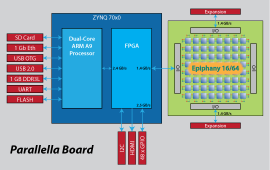

##############################
Adapteva Parallella Hardware
##############################

Introduction
-------------------------
Parallella_ is a multicore, heterogenous, developer board with newtwork on chip which ensures the high  performance. It is a open sourced board which helps us to have more insight over the hardware.

Hardware Specification
-------------------------
Below are overview of the Adapteva Parallella for hardware specification. 

* 	zynq-7000 Series Dual-core ARM A9 CPU (Z-7010 or Z-7020)
* 	16 or 64-core Epiphany Multicore Accelerator
* 	1GB RAM
* 	MicroSD Card
* 	2x USB 2.0
* 	4 general purpose expansion connectors
* 	10/100/1000 Ethernet
* 	HDMI port
* 	Linux Operating System

*Overheating of board can be managed with a cooler fan or a by placing the board in a lateral position could be a temporary solution.

.. _Parallella : https://www.adapteva.com/parallella/