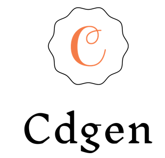

##############################
Introduction to CDGen
##############################

Overview
-------------------------

The CDGen is an application using Eclipse APP4MC for model to text conversion using the System Model to enhance cost-effectiveness and decreasing the chance of errors when compared to manual coding. The main outputs of this application are C and Header files which hold all the details of the model for the compilation and building process(generating executables for running on the Processor). Based on the  Eclipse Modeling Framework, its capabilities not only include hardware and software modeling but in addition, tools for visualization and processing. The application will be added to the set of tools of Eclipse APP4MC.

The project deals with creating an application which is capable of generating the code from the System Model. The System Model contains the information required to simulate, analyze and optimize performance. It contains extensive information about software, hardware, timing behavior, and constraints for the system under development.  This application is planned in a systematic approach with a lot of flexibility. CDGen enhances a user-friendly experience. Below is the list of action items in the plan.

Configuration
-------------------------
There are 6 main scheduling configuration available in this tool:

*	FreeRTOS Preemptive Scheduler
*	FreeRTOS Cooperative Scheduler
*	POSIX Preemptive Scheduler
*	POSIX Cooperative Scheduler
*	Rate Monotonic Preemptive Scheduler
* 	Rate Monotonic Cooperative Scheduler

Deliverables
-------------------------
*	Source Code for the CDGen
*	Documentation

